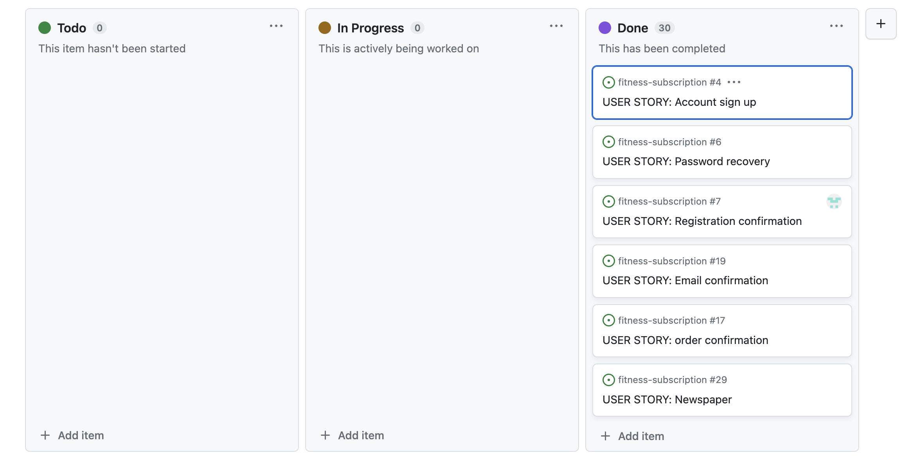
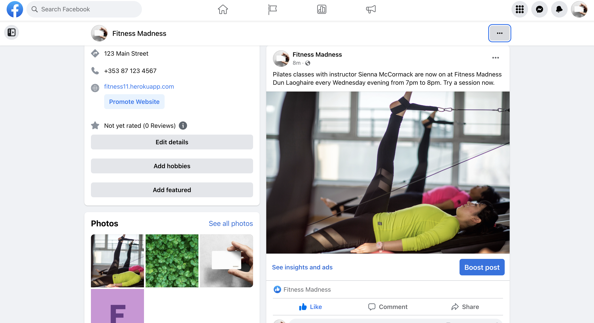
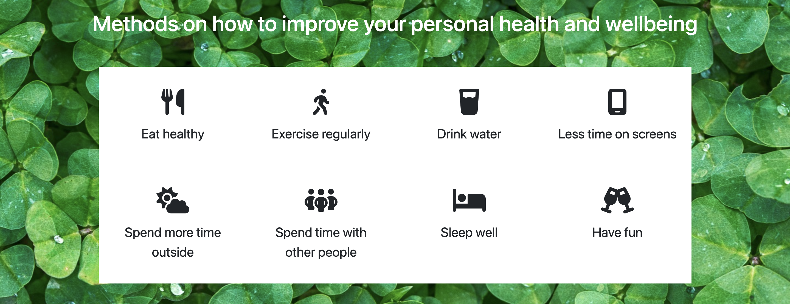

# Fitness Madness

Welcome to the readme file of my project.

## Introduction

Fitness Madness is a fitness website that encourages the user to become more fit.

The website offers the user the ability to buy gym passes that is valid in six gyms across Dublin city. (This is done solely for the project, Fitness Madness is not an actual gym in Ireland.) The website also offers the ability to record and share their progress with other users as well as buying sports products and meal plans as well as viewing other people's progresses and thoughts on products that the website offers.

You can find a link to my website [here](https://fitness11.herokuapp.com/).

# Table of Contents
[1.User Experience(UX)](#1-user-experience)
- 1.1 User Goals
- 1.2 User Expectations
- 1.3 User Stories
- 1.4 Wireframe

[2.Features](#2-features)

[3.Technology](#3-technology)

[4.Testing](#4-testing)

[5.Bugs](#5-bugs)

[6.Deployment](#6-deployment)

[7.Project Completion](#7-project-completion)

[8.Improvements](#8-improvements)

[9.Acknowledgements](#9-acknowledgements)

# 1. User Experience

## 1.1 User Goals

[Return to the Table of Contents](#table-of-contents)

The user should be able to buy subscriptions for the gym as well as buying products that the website has to sell. The user can also choose to login or signup to access more functionalities. The user should be able to know what the website is used for without having to read deep into it. The user should also be able to view events and blogs without having to login.


## 1.2 User Expectations

### User Goals

**Epic 1 - Shopping Experience**

* As a shopper, I want to easily find the products and their details.

* As a shopper, I want to view products on a specific category.

* As a shopper, I want to be able to sort the products depending on their price, rating or category.

* As a shopper, I want to be able to search for products using specific keywords.

* As a shopper, I want to easily select the quantity of products to be purchased.

* As a shopper, I want to easily view the current purchase amount.

**Epic 2 - Shopping Bag and Checkout**

* As a shopper, I want to view all items currently on my shopping bag and be able to update them.

* As a shopper, I want to easily provide my shipping and payment information during the checkout.

* As a shopper, I want to feel my personal and payment data is being handled securely.

* As a shopper, I want to receive an order confirmation once I have finished my purchase.

* As a shopper, I want to receive an order confirmation email for my records.

**Epic 3 - User Accounts**

* As a frequent shopper, I want to be able to register an account using my email address to be able to keep my records and interact with the website.

* As a frequent shopper, I want to receive a confirmation once my account has been registered to make sure the information entered was correctly.

* As a registered shopper, I want to easily log in and out from my account.

* As a registered shopper, I want to be able to recover access to my account in case I forget my password.

* As a registered shopper, I want to have a personalized profile page where I can keep my contact information updated and see my past orders.

**Epic 4 - Product Reviews**

* As a shopper, I want to be able to read product reviews left by other shoppers.

* As a shopper, I want to view my all the reviews made by me.

* As a registered shopper, I want to be able to leave product reviews and rate the products.

* As a shopper, I want to be able to edit or delete my reviews.

**Epic 5 - Favorites**

* As a registered shopper, I want to be able to keep a list of my favorite products to purchase again in the future.

* As a registered shopper, I want to be able to easily add and remove favorite products.

**Epic 6 - Blogs**

* As a registered shopper, I want to be able to view the blogs of fellow shoppers or users of the site.

* As a registered shopper, I want to be able to upload my progresses.

* As a registered shopper, I want to be able to edit, delete and view all my blogs.

**Epic 7 - Product Admin**

* As a site admin, I want to be able to add and update products.

* As a site admin, I want to be able to remove product no longer available.

* As a site admin, I want to be able to add events that are coming up and remove old expired ones.

**Epic 8 - Newsletter Subscription**

* As a site admin, I want shoppers to be able to provide their contact information to be able to reach out to them with information and offers.

## 1.3 User Stories

[Return to the Table of Contents](#table-of-contents)

Throughout the project, I used github user stories to record and keep track of my tasks. At the beginning, I listed all the things I needed to do, moved them to the second column when I am working on them and finally to the last column when I am done with that task.


## 1.4 Wireframes

[Return to the Table of Contents](#table-of-contents)

This was what I had in mind when I was coming up with the skeleton of the project.

This is what the index page should look like:


This is what the about page should look like:


This is what the product page should look like:


This is what the product-detail page should look like:


This is what the event page should look like:


This is what the blog page should look like:


This is what the checkout page should look like:


## 1.5 Strategy Table

Opportunity/Problem/Feature| Importance| Viability/Feasibility
------------ | -------------------------|---------
Responsive design | 5 | 5
Create, edit and delete products | 5 | 5
Account registration | 5 | 5
User profile | 5 | 5
Favorites | 4 | 4
Save shipment information | 5 | 5
Product quick view | 3 | 2
Sort products by different criteria | 5 | 5
Search products by name or description | 5 | 5
Product details view | 5 | 5
Rate products | 4 | 3
Write product reviews | 4 | 3
Display current purchase total | 5 | 5
View current shopping cart | 5 | 5
Edit quantities inside the shopping bag | 4 | 4
Shopping cart quick view | 3 | 3
Card payment | 5 | 5
Newsletter subscription | 5 | 5
View Blogs | 3 | 3
View Events | 3 | 3

### Scope

According to the strategy table, not all features can be implemented in the first release of the project. For this reason, the project will be divided in multiple phases. 

**First Phase**

* Responsive design

* Create, edit and delete products

* Account registration

* User profile

* Save shipment information

* Sort products by different criteria

* Search products by name or description

* Product details view

* Display current purchase total

* View current shopping cart

* Edit quantities inside the shopping bag

* Card payment

* Newsletter subscription

**Second Phase**

* Favorites

* Rate products

* Write product reviews

* Upload blogs

* View events

## Marketing

### Search Engine Optimisation

Search Engine Optimisation

To improve the search index rating on Google, research was carried out using a number of tools, such as [Wordtracker](https://www.wordtracker.com/) to search for relevant keywords to use in meta tags in the project head element.

The selected keywords are:

* health 
* healthy
* wellbeing
* fit
* gym
* outdoors
* exercise
* sport
* nutrition

These keywords remain a work in progress however. As is normal practise, in production these keywords would be monitored via, for example, Google Analytics, to determine which terms are driving traffic to the site. 

These terms could then be added to, or removed as deemed necessary, and with continual improvement and refinement of these over time should utlimately assist in the site ranking higher on Google.


### Business Model


#### Company description

NoPlast is a B2C company that offer our customers the ability to buy sportswear online as well as signing up to be a member of a gym. Information is also provided to the customer on how to improve their mental wellbeing and having blogs greatly enhances this process.


#### Customers

Our target audience is more likely to be between the ages of 15 and 35. Since they have less time on their hand and would have a greater chance of spending time exercising in a gym.

#### Competitors

We see that we have three types of competitors. 
There are companies that have the same interest and vision Fitness Madness but the majority of them are mainly focused on the membership part and don't have an online retail service.
The other type of competitors would be commercial brands like Adidas, Nike, Under Armor who provides a range of sportswear and equipment but they don't offer a gym membership.
There are some companies that offer the same kind of customer service as we do. But not all of them will have the exact some functions as our website.

#### SWOT analysis

**Strengths**

* Having many services available to the customer.
* Information for the customer that gives them a deeper insight as to how to improve their health and wellbeing.
* True interest for our mission within the company.

**Weaknesses**

* Small company
* Small marketing budget

**Opportunities**

* Increasing events and awareness

**Threats**

* Shipping problem with products produced in other countries due to covid and other unpredictable factors.
* Shipping costs that is variable
* Bigger companies that can change their product supply.
* Other similar companies can get more PR and bigger market share. 

**Marketing Strategy**

Due to our small marketing budget, we have decided to start a Facebook Business page and interact with our customers through the social platform. Increasing the number of events that is happening within the company will speed up the spreading of the news and generate more attention to the business. Having influencers on Instagram marketing the business would also help spread the word, this could be done in exchange for free gym membership. It's better to focus on what we have at the minute rather than increasing the product range will ensure the quality of our service and products. 

**Facebook Business page**

See the live Facebook Business page [here](https://www.facebook.com/profile.php?id=100094215226907).



# 2. Features

[Return to the Table of Contents](#table-of-contents)

## 2.1 Navigation Bar

The navigation bar is placed at the top of all pages. The navigation bar is dynamic in that meaning depending on if the user is logged in or not the options will change. The navbar will also change depending on whether the user is a superuser or not.

This is the account dropdown menu for a superuser.


This is the account dropdown menu for a non-superuser.


This is the navbar of a logged in user.


This is the navbar before a user is logged in.


## 2.2 Login, Signup and Logout

The login function would allow the user to signin if the user already has an account.


If the user doesn't have an account, then s/he can sign up for one.


And when a user wants to logout of their account, they can use the logout function.


The user has to confirm their email address before the website can let them login.


## 2.3 About, Contacts and Homepage

The homepage allows the user to choose where on the site they want to navigate to. This includes signing up to the community, viewing the latest products, looking at different peoples' blog post or viewing events that are happening.


The about page contains information about the website as well as a guide to healthy living and contact information.

At the top of the page, this is where the user can read about the website.


Then the user can view a guide on what is good for them in order to improve one's personal health and wellbeing.



Then the user will see a list of where the fitness madness gyms are located as well as their contact information.


## 2.4 Add event, blog or product

Any logged in user would be able to share their experiences or latest progress on the blog page. This page is visible to all.

This is the blog page where the user can see what blogs they have posted.


This is the add a blog page.


Only superusers can add events or products as well as editing or deleting them.


This is the events page.


## 2.5 View Product and product detail page

Any user of the website whether they are logged in or not can view the products and product details page.


When the user presses a product image, they will be brought to that product's detail page.


The user can also leave a review for the product that others users can see.


## 2.6 Favorites and quantity

On the product detail page the if logged in can add a product to their favorites by pressing the heart icon. This is also true if the user wants to remove the item from their favorites. The user can increment the quantity until the desired amount and press add to bag. This will add the product to the bag.


This is the favorites page in which all the user's favorites are stored.


## 2.65 Back to top

This little arrow when combined with some Javascript allows the user to move back to the top of the page when they are anywhere but the top of the page.


## 2.7 Bag

The bag shows a list of all the items that the user has added to the bag while also providing the user with the functionality of adjusting the quantity or deleting the product from the bag.


## 2.8 Checkout and confirmation

Stripe is used in the checkout section of the website. A webhook would be sent even if the user accidently logs out or leaves the page in the middle of a transaction so that a record is kept. A confirmation email alongside a confirmation notification will be sent to the user.

This is what the user will see once the payment comes through.


This is the checkout page.


## 2.9 Footer

The footer contains the policy, the website's facebook page and an option to subscribe to the website so that the user can receive the latest news and offers.


# 3. Technology

[Return to the Table of Contents](#table-of-contents)

* [Django Allauth](https://django-allauth.readthedocs.io/en/latest/) was used for user authentication, registration, and account management.

* [Django Crispy Form](https://django-crispy-forms.readthedocs.io/en/latest/) was used to control the rendering of the forms. 

* [Django Countries](https://pypi.org/project/django-countries/) was used to provide country choices for use with forms and a country field for models.

* [Pillow](https://pypi.org/project/Pillow/) was used to add image processing capabilities.  
 
* [Gunicorn](https://gunicorn.org/) was used as Python WSGI HTTP Server for UNIX to support the deployment of Django application.  

* [Django](https://www.djangoproject.com/) was used as web framework.

* [Django Template](https://jinja.palletsprojects.com) was used as a templating language for Django to display backend data to HTML.
   
* [Bootstrap 5](https://getbootstrap.com/docs/5.0/getting-started/introduction/) was used throughout the website to help with styling and responsiveness.

* [Google Fonts](https://fonts.google.com) was used to import the font into the html file, and were used on all parts of the site.

* [Font Awesome](https://fontawesome.com) was used throughout the website to add icons for aesthetic and UX purposes. 

* [jQuery 3.6.0](https://jquery.com/) was used as a JavaScript library to help writing less JavaScript code. 

* [MD](https://en.wikipedia.org/wiki/Markdown) (Markdown) was used to create this readme file.

* [Gitpod](https://www.gitpod.io/) was used for the code input and edit for this project.

* [Github](https://github.com/) was used to store my repository and code when it is not in use.

* [Slack](https://slack.com/intl/en-ie/) was used for communications when I was having trouble creating code.

* [Pep8 Validator](http://pep8online.com/) was used to check for bugs in my code.

* [Heroku](https://id.heroku.com/login) was used to deploy my project.

* [Python](https://en.wikipedia.org/wiki/Python_(programming_language)) was used to create the website.

* [JS](https://en.wikipedia.org/wiki/JavaScript)(JavaScript) was used to make the website.

* [HTML5](https://en.wikipedia.org/wiki/HTML5) (Hypertext Markup Language 5) was used to create the webpages.

* [CSS](https://en.wikipedia.org/wiki/CSS) (Cascading Style Sheets) was used to style the webpages.

* [PostgreSQL](https://www.postgresql.org/) was used as a database.

* [Mailchimp](https://mailchimp.com/?currency=EUR) was used to create the subscribe to mailing function.

* [Private Policy Generator](https://www.websitepolicies.com/privacy-policy-generator?gclid=Cj0KCQjwtamlBhD3ARIsAARoaExPzjR6b9USebdVOz4qizvHK3Q62drN_WjkrD-CWuR1DDt0AYhGn5YaAvu3EALw_wcB) is used to generate the private policy.

* [Pixabay](https://pixabay.com/) was used to download images. These images were then uploaded onto Cloudinary.

* [Cloudinary](https://cloudinary.com/) was used as a database to store images.

* [Google Fonts](https://fonts.google.com/) was used to import the font style for my project.

* [W3C Markup](https://validator.w3.org/),[Jigsaw validation](https://jigsaw.w3.org/) and [JSHint](https://jshint.com/) tools were used to check for bugs in my code.

* [Balsamiq](https://balsamiq.com/) was used to create my webframes.

* [Stripe](https://stripe.com/en-gb-nl) was used to process all online payments transactions.

* [Favicon.io](https://favicon.io) was used to create the site favicon.

* [Amazon Web Service S3](https://aws.amazon.com/s3/) was used to store all static and media files in production.  

* [SQLite](https://www.sqlite.com/index.html) was used as a single-file database during development.

* [Heroku Postgres](https://www.heroku.com/postgres) database was used in production, as a service based on PostgreSQL provided by Heroku.


# 4. Testing

[Return to the Table of Contents](#table-of-contents)

The contents of the testing section can be find [here](testing.md).

# 5. Bugs

Initially I couldn't understand why there was a bad request 400 error when I connected the s3 bucket to my heroku app. Eventually I realised that this was because I had added forward slashes to almost all my static files. I did this because the static file would only show in the local host if a forward slash was added. This later on proved to be a problem but I was able to resolve the error by removing the slash.

The heart will show up as a user favorite even if the user hasn't added the product to their favorite. This is a result of another user adding the product to their favorite.

# 6. Deployment

[Return to the Table of Contents](#table-of-contents)

### Deployment to Heroku 
This project is deployed on Heroku for production, with all static and media files stored on AWS S3. These are steps to deploy on Heroku:

1. Navigate to Heroku.com, create a new account or login if you already have an account. On the dashboard page, click "Create New App" button. Give the app a name, the name must be unique with hypens between words. Set the region closest to you, and click "Create App".   
2. On the resources tab, provision a new Heroku Postgres database.  
3. Configure variables on Heroku by navigating to Settings, and click on Reveal Config Vars. You may not have all the values yet. Add the others as you progress through the steps.   
   Varables | Key   
   ---| ---   
   AWS_ACCESS_KEY_ID | your_access_key_id_from_AWS   
   AWS_SECRET_ACCESS_KEY | your_secret_access_key_from_AWS  
   DATABASE_URL | your_database_url   
   EMAIL_HOST_PASS | your_app_password_from_your_email   
   EMAIL_HOST_USER | your_email_address  
   SECRET_KEY | your_secret_key 
   STRIPE_PUBLIC_KEY | your_stripe_public_key  
   STRIPE_SECRET_KEY | your_stripe_secret_key  
   USE_AWS | True 

4. If you haven't install it, install dj_database_url and psycopg2.
   ```
   pip3 install dj_database_url
   pip3 install psycopg2-binary
   ```

5. Set up a new database for the site by going to the project's settings.py and importing dj_database_url. Comment out the database's default configuration, and replace the default database with a call to dj_database_url.parse and pass it the database URL from Heroku (you can get it from your config variables in your app setting tab)
   ```
   DATABASES = {
     'default': dj_database_url.parse('YOUR_DATABASE_URL_FROM_HEROKU')
   }
   ```
6. Run migrations
   ```
   python3 manage.py migrate
   ```  
7. Import data to the database.
    - Make sure your manage.py file is connected to your sqlite3 database.
    - Use this command to backup your current database and load it into a db.json file:
    ```
    ./manage.py dumpdata --exclude auth.permission --exclude contenttypes > db.json
    ```
    - Connect your manage.py file to your postgres database
    - Then use this command to load your data from the db.json file into postgres:
    ``` 
    ./manage.py loaddata db.json
    ``` 
8. Set up a new superuser, fill out the username, email address, and password.
   ```
   python3 manage.py create superuser
   ```  
9. Remove the database config from Heroku and uncomment the original config. Add a conditional statement to define that when the app is running on Heroku. we connect to Postgres, and otherwise, we connect to Sqlite.   
   ```
   if 'DATABASE_URL' in os.environ:
      DATABASES = {
         'default': dj_database_url.parse(os.environ.get('DATABASE_URL'))
      }
   else:
      DATABASES = {
         'default': {
            'ENGINE': 'django.db.backends.sqlite3',
            'NAME': BASE_DIR / 'db.sqlite3',
         }
      }
   ```  
10. Install gunicorn which will act as the webserver, and put it on the requirements.txt.   
   ``` 
   pip3 install gunicorn
   pip3 freeze > requirements.txt
   ```
   Note: you don't have to do this if you've installed all dependencies in the requirements.txt file.
11. Create a Procfile, to tell Heroku to create a web dyno, which will run unicorn and serve the Django app.   

   Inside the Procfile:
   ```
   web: gunicorn shoes_and_more.wsgi:application
   ```
12. Login to Heroku through CLI, using ```heroku login```. Once logged in, disable the collect static temporarily, so that Heroku won't try to collect static files when it deploys.
   ```
   heroku config:set DISABLE_COLLECTSTATIC=1 --app shoes-and-more
   ```
   And add the hostname of the Heroku app to allowed hosts in the project's settings.py, and also add localhost so that Gitpod will still work as well:  
   ```
   ALLOWED_HOSTS = ['shoes-and-more.herokuapp.com', 'localhost']
   ```   
13. Add, commit, and push to gitpod and then to Heroku. After pushing to gitpod as usual, initialize git remote first:
   ```
   heroku git:remote -a shoes-and-more
   ``` 
   Then push to Heroku:
   ```
   git push heroku main
   ```
14. Go to the app's dashboard on Heroku and go to Deploy. Connect the app to Github by clicking Github and search for the repository. Click connect. Also enable the automatic deploy by clicking Enable Automatic Deploys, so that everytime we push to github, the code will automatically be deployed to Heroku as well.  
15. Go back to settings.py and replace the secret key setting with the call to get it from the environment, and use empty string as a default. 
   ```
   SECRET_KEY = os.environ.get('SECRET_KEY', '')
   ```
   Set debug to be true only if there's a variable called development in the environment.
   ```
   DEBUG = 'DEVELOPMENT' in os.environ
   ```
  

### AWS Bucket Creation   
All static and media files in this project are stored in [Amazon Web Services S3 bucket](https://aws.amazon.com/) which is a cloud based storage service. You can create your own bucket by following these steps:   
1. Go to [Amazon Web Service website](https://aws.amazon.com/) and click on Create An AWS Account, or login if you already have an account.  
2. Login to your new account, go to AWS Management Console and find service S3. Click on Create Bucket.   
   - Give it a name (I recommend naming your bucket to match the Heroku app name), and choose region closest to you.  
   - In Object Ownership section, choose ACLS enabled. and Bucket Owner Preffered.   
   - Uncheck box 'Block All Public Access'.  
   - Check box 'I acknowledge that the current settings might result in this bucket and the objects within becoming public.'  
   - Click on Create Bucket, and your bucket is created.  
3. Click on your newly created bucket, and navigate to the Properties tab. Scroll down to the bottom until you find Static Website Hosting. Click on Edit, then enable. 
   - Hosting type: choose Host a Static Website   
   - Index document: index.html  
   - Error document: error.html
   - Click on Save Changes.  
4. Navigate to the Permissions tab. Scroll down to the bottom until you find Cross-origin resource sharing (CORS). Click on Edit, and paste in this Cors Configuration below, which is going to set up the required access between the Heroku app and this S3 bucket. Click on Save Changes. 
   ```
   [
      {
         "AllowedHeaders": [
            "Authorization"
         ],
         "AllowedMethods": [
            "GET"
         ],
         "AllowedOrigins": [
            "*"
         ],
         "ExposeHeaders": []
      }
   ]
   ```   
   Still on the Permissions tab, find Bucket policy, click on Edit, and then go to Policy Generator. 
   - Select Type of Policy: choose S3 Bucket Policy   
   - Effect: choose Allow   
   - Principal: *   
   - Actions: select GetObject   
   - Fill in the Amazon Resource Name (ARN), from the Bucket ARN back in the Bucket Policy   
   - Click on the Add Statement and then Generate Policy. Copy the policy and paste in the bucket policy editor.  
   - Add a slash star on to the end of the resource key (because we want to allow access to all resources in this bucket). Click Save.
      The resource key should look like this
      ```  
      "Resource": "arn:aws:s3:::YOUR_BUCKET_NAME/*",  
      ```  
   
   Still on Permissions tab, go to Access Control List (ACL) section, click Edit and enable List for Everyone (public access), and accept the warning box.  

5. With the bucket ready, now we need to create a user to access it through another service called IAM which stands for Identity and Access Management. Go back to the service menu and open IAM.   
   a. Create a group for our user to live in.  
      Click User Groups, and then create a new group with a name you want. I gave the group the name: manage-shoes-and-more. Scroll down to the bottom and click on Create Group.     
   b. Create an access policy giving the group access to the S3 bucket that has been created.  
      - Click on Policy, and then Create Policy. Go to the JSON tab, and then select import managed policy, which will let us import one that AWS has pre-built for full access to S3. Search for S3, then import the AmazonS3FullAccess policy.   
      - Because we only want to allow full access to our new bucket and everything within it, paste the bucket ARN (from the bucket policy page in s3) in the JSON editor.
      ```
      "Resource": [
         "arn:aws:s3:::YOUR_BUCKET_NAME",
         "arn:aws:s3:::YOUR_BUCKET_NAME/*"
      ]
      ```  
      Now click on Next:Tags, then click Next:Review. 
      - Give the review policy a name and a description, then click Create Policy. The policy has now been created. 
      
   c. Finally, assign the user to the group so it can use the policy to access all our files.  
      - Go to User Groups, and select the group. Go to the Permissions tab, open the Add Permissions dropdown, and click Attach Policies.  
      - Select the policy and click Add permissions at the bottom.  
      - Create a user to put in the group, by going to the Users page, and clicking Add Users.  
      - Set a user name, give them access type: Programmatic access, and then click Next: Permissions.   
      - Check on the group that has the policy attached. Click Next: Tags, then click Next: Review, and lastly Create User.     
      - Download the csv file and save it.  


### Connect Django to AWS Bucket 
Note: If you've forked the repository, all of these steps are already done/ written on the files. Make sure you've installed all dependencies in the requirements.txt file, add all the AWS-related Config Vars to Heroku, and remove the DISABLE_COLLECTSTATIC variable from Heroku.   
Here are the steps I took to connect Django to AWS:  
1. Install two new packages: boto3 and django-storages. Freeze them into requirements.txt.   
   ```
   pip3 install boto3
   pip3 install django-storages 
   pip3 freeze > requirements.txt  
   ```  
2. Add storages to the Installed Apps in settings.py.
3. In settings.py, we need to set cache control, set bucket configurations, set static and media files location, and override static and media URLs in production. We'll only want to do this on Heroku, so add an if statement as well.
   ```
   if 'USE_AWS' in os.environ:
      # Cache control
      AWS_S3_OBJECT_PARAMETERS = {
         'Expires': 'Thu, 31 Dec 2099 20:00:00 GMT',
         'CacheControl': 'max-age=94608000',
      }

      # Bucket Config
      AWS_STORAGE_BUCKET_NAME = 'YOUR_BUCKET_NAME'
      AWS_S3_REGION_NAME = 'YOUR_REGION'
      AWS_ACCESS_KEY_ID = os.environ.get('AWS_ACCESS_KEY_ID')
      AWS_SECRET_ACCESS_KEY = os.environ.get('AWS_SECRET_ACCESS_KEY')
      AWS_S3_CUSTOM_DOMAIN = f'{AWS_STORAGE_BUCKET_NAME}.s3.amazonaws.com'

      # Static and media files
      STATICFILES_STORAGE = 'custom_storages.StaticStorage'
      STATICFILES_LOCATION = 'static'
      DEFAULT_FILE_STORAGE = 'custom_storages.MediaStorage'
      MEDIAFILES_LOCATION = 'media' 

      # Override static and media URLs in production
      STATIC_URL = f'https://{AWS_S3_CUSTOM_DOMAIN}/{STATICFILES_LOCATION}/'
      MEDIA_URL = f'https://{AWS_S3_CUSTOM_DOMAIN}/{MEDIAFILES_LOCATION}/'
   ```
   Set the Config Vars on Heroku. On your app's dashboard on Heroku, go to Settings and click Reveal Convig Vars. Set this variables:
   Variables | Value
   --- | ---
   AWS_ACCESS_KEY_ID | your access key id from the csv file that you've downloaded before
   AWS_SECRET_ACCESS_KEY | your secret access key from the csv file that you've downloaded before
   USE_AWS | True    

   Also remove the COLLECTSTATIC variable from the Config Vars.   

4. We then want to tell Django that in production we want to use S3 to store our static files whenever someone runs collectstatic, and that we sent any uploaded images to go there as well.  
Create a custom_storages.py file in your project's root directory, and inside it, include the Static and Media Storage locations: 
   ```
   from django.conf import settings
   from storages.backends.s3boto3 import S3Boto3Storage
 

   class StaticStorage(S3Boto3Storage):
      location = settings.STATICFILES_LOCATION


   class MediaStorage(S3Boto3Storage):
      location = settings.MEDIAFILES_LOCATION
   ```  

5. Finally, push these changes on Github.
   ```
   git add .
   git commit -m "Your commit message"
   git push
   ```

# 7. Project Completion

[Return to the Table of Contents](#table-of-contents)

## Desktop Version

## Mobile Version


# 8. Improvements

[Return to the Table of Contents](#table-of-contents)

This is a resubmission attempt since the last one didn't meet the project's criteria. 

# 9. Acknowledgements

[Return to the Table of Contents](#table-of-contents)

* Credits is given to [Noplast](https://github.com/josswe26/noplast) for given me some code to be used in the programme. This is the code that was implemented into my programme in which I modified.

```
@login_required
def add_review(request, product_id):
    """ Display form to add a review to a product """
    product = get_object_or_404(Product, pk=product_id)
    user_review = Review.objects.filter(
        author=request.user, product=product)

    # Check if user already submitted a review for the product
    if user_review:
        messages.error(request,
                       'You have already submitted a review for this product')
        return redirect(reverse('product_detail', args=[product.id]))
    else:
        if request.method == 'POST':
            form = ReviewForm(request.POST, request.FILES)
            if form.is_valid():
                form.instance.author = request.user
                form.instance.product = product
                form.save()
                messages.success(request,
                                 'Your product review has been submitted')

                update_product_rating(product)

                return redirect(reverse('product_detail', args=[product.id]))
            else:
                messages.error(request, 'Failed to submit the review. \
                    Please ensure the form is valid.')
        else:
            form = ReviewForm()

    template = 'reviews/add_review.html'

    context = {
        'product': product,
        'form': form,
    }

    return render(request, template, context)
``` 
```
@login_required
def add_or_remove_favorite(request, product_id):
    """ Add product to the user's favorites """
    product = get_object_or_404(Product, id=product_id)

    if product.users_favorite.filter(id=request.user.id).exists():
        product.users_favorite.remove(request.user)
        messages.success(request,
                         f'{product.name} has been \
                         removed from your favorites.')
    else:
        product.users_favorite.add(request.user)
        messages.success(request,
                         f'{product.name} has been \
                         added to your favorites.')

    return HttpResponseRedirect(request.META.get('HTTP_REFERER'))
```
```
def update_product_rating(product):
    """ Update the rating field for the product """

    total_reviews = Review.objects.filter(product=product)
    nr_of_total_reviews = total_reviews.count()
    ratings_sum = 0

    if nr_of_total_reviews <= 0:
        product.rating = None
    else:
        for review in total_reviews:
            ratings_sum += review.rating

        product.rating = ratings_sum / nr_of_total_reviews

    product.save()
```
* Credits is given to the BoutiqueAdo walkthrough tutorial for how to create the website from scratch and its code. This was used as my base template in which I modified.

* The deployment process was taking from Noplast.

* For the Readme file, I took the structure from my previous Readme file and used it here. Reference is given to https://github.com/dhakal79/Portfolio-project-MS1 which is the readme file I took into consideration when I was doing my first one.

* The ideas and code I implemented into this project were taught to me by Code Institute.

* My mentor Marcel Mulders supported me throughout the whole project. I couldn't have done it without his help.