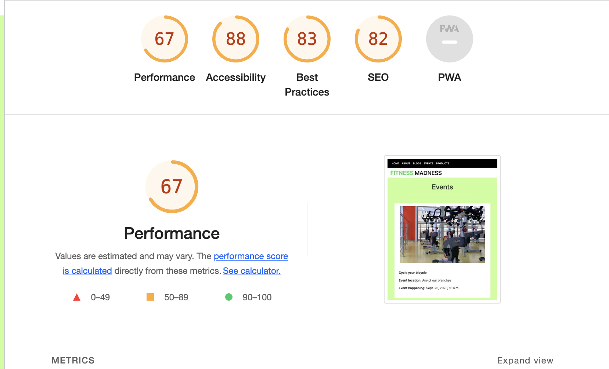

## 4.1 Manual Testing

### Epic 1 - Shopping Experience

#### As a shopper, I want to easily find the products and their details.

* Products page is available, displaying the products and their main details.

#### As a shopper, I want to view products on a specific category.

* Links to each product category are provided in the home page.

* A product navigation bar is present in the products page, allowing the shopper to filter products per category.

#### As a shopper, I want to be able to sort the products depending on their price, rating or category.
* A sorting functionality is provided in the products page, allowing the shopper to sort products by price, name, rating and category.

#### As a shopper, I want to be able to search for products using specific keywords.

* A search bar is available on the website header, allowing the shopper to find a product by keyword across the whole website.

#### As a shopper, I want to easily select the quantity of products to be purchased.

* Quantity field is available in the product details page, allowing the shopper to select the desired product quantity before adding the product to the shopping bag.

#### As a shopper, I want to easily view the current purchase amount.

* The current purchase amount is available under the shopping cart icon in the header, making the information available across the whole website.

### Epic 2 - Shopping Bag and Checkout

#### As a shopper, I want to view all items currently on my shopping bag and be able to update them.
* Products added to the shopping bag are displayed in the shopping bag page.

* A quantity form is available in the shopping bag page for the shopper to update the product quantity.

#### As a shopper, I want to easily provide my shipping and payment information during the checkout.

* A form is available at the checkout for the shopper to provide the necessary information to complete the purchase.

#### As a shopper, I want to feel my personal and payment data is being handled securely.

* Stripe payments has been implemented as a payment method for the website in order to provide secure and easy transactions for the shoppers.

#### As a shopper, I want to receive an order confirmation once I have finished my purchase.

* A checkout success page is displayed to the shopper after completing the purchase.

#### As a shopper, I want to receive an order confirmation email for my records.

* An email is being sent to the email address provided by the shopper during the checkout.

### Epic 3 - shopper Accounts

#### As a frequent shopper, I want to be able to register an account using my email address to be able to keep my records and interact with the website.

* All-auth has been implemented to handle user authentication, allowing the user to register an account.

#### As a frequent shopper, I want to receive a confirmation once my account has been registered to make sure the information entered was correctly.

* A confirmation is sent to the registered email address in order to validate it.

#### As a registered shopper, I want to easily log in and out from my account.

* All-auth has been implemented to handle user authentication, allowing the user to easily login and logout from their account.

#### As a registered shopper, I want to be able to recover access to my account in case I forget my password.

* All-auth can send a recovery link to the shopper's email address in the case they forget their credentials.

#### As a registered shopper, I want to have a personalized profile page where I can keep my contact information updated and see my past orders.

* A profile page is available for the shopper to keep their contact information updated as well as access their past orders.

### Epic 4 - Product Reviews

#### As a shopper, I want to be able to read product reviews left by other shoppers.

* Product reviews are available in the product details page for each product.

#### As a shopper, I want to be able to see my reviews

* A button with my reviews is available as a dropdown item for the user

#### As a registered shopper, I want to be able to leave product reviews and rate the products.

* Forms are available for registered shoppers if to review and rate products.

#### As a shopper, I want to be able to edit or delete my reviews.

* Registered shoppers are also able to update or delete their existing reviews.

### Epic 5 - Favorites

#### As a registered shopper, I want to be able to keep a list of my favorite products to purchase again in the future.

* A favorites page has been created for registered shoppers to keep track of their favorite products.

#### As a registered shopper, I want to be able to easily add and remove favorite products.

* A favorites icon is present inside the image in the products details page, to easily add and remove products to the favorites list.

### Epic 6 - Blogs

#### As a registered shopper, I want to be able to view the blogs of fellow shoppers or users of the site.

* A blog page is available at the top of the navbar for this function

#### As a registered shopper, I want to be able to upload my progresses.

* An add button is available at the top of the blogs page which will allow the user to add a blog.

#### As a registered shopper, I want to be able to edit, delete and view all my blogs.

* In the my blog section which is available when you press my accounts, the user can edit and delete their blogs.

### Epic 7 - Product Admin

#### As a site admin, I want to be able to add and update products.

* Full CRUD functionality has been implemented for site admins to manage the website products.

#### As a site admin, I want to be able to remove product no longer available.

* Full CRUD functionality has been implemented for site admins to manage the website products.

#### As a site admin, I want to be able to add events that are coming up and remove old expired ones.

* Full CRUD functionality has been implemented for site admins to manage events.

### Epic 8 - Newsletter Subscription

#### As a site admin, I want shoppers to be able to provide their contact information to be able to reach out to them with information and offers.

* A newsletter subscription form had been added to the website footer using mailchimp which allows the user to subscribe to the website.

### 4.11 Website Analysis on a Desktop using Lighthouse

The performance of my website mediocre on the website.

### 4.1.6 Website Analysis on a Mobile using Lighthouse

The performance of my website is not great on the mobile version. 

Both lighthouse analysis aren't great. I think the reason is that the pictures are too big.

## 4.2 Testing with Tools

### 4.2.1 Am I responsive

I used the "Inspect" command on google chrome to check how responsive my website was with different screen sizes and appliances. These include:

- IPhone SE
- Iphone XR
- IPhone 12 Pro
- Pixel 5
- Samsung Galaxy S8+
- Samsung Galaxy S20 Ultra
- IPad Air
- IPad Mini
- Surface Pro 7
- Surface Duo
- Galaxy Fold
- Samsung Galaxy A51/71
- Nest Hub
- Nest Hub Max

The website worked well on all of them. None of them distorts the website in any significant way.

### 4.2.2 W3C Validator Tools

[W3C Markup](https://validator.w3.org/) was used to validate the html codes of my project. It was used to check if any errors were available and I had to correct them before continuing onto the next step. This was hard to do because the system didn't like me using python functions in between, therefore I had to go around the functions and added in little segments at a time. The other option was to paste everything in and when the problems showed up, I ignored the ones that was associated with the python code.

[W3C CSS Validation Service](https://jigsaw.w3.org/css-validator/) was used to check that all the code written in css were correct. Since most of the HTML code was decorated with Bootstrap, there wasn't a lot of css code. 

The terminal in gitpod was used to check for errors in my python code. 
These were the initial problems that were associated with my code. These were easily resolved by adding in indentations, getting rid of white spaces and adding an extra line between classes in the views.py file. The lines that were too long and caused a problem were shortened by separating them onto separate lines. Finally only some minor errors that were already present in the python code upon installing the package are left. Below is a picture that shows no major error in the code.

The Javascript that I have been using in this project came from an external source and when I pasted it in into , the system tells me that there were no errors that would have an impact on the code.
